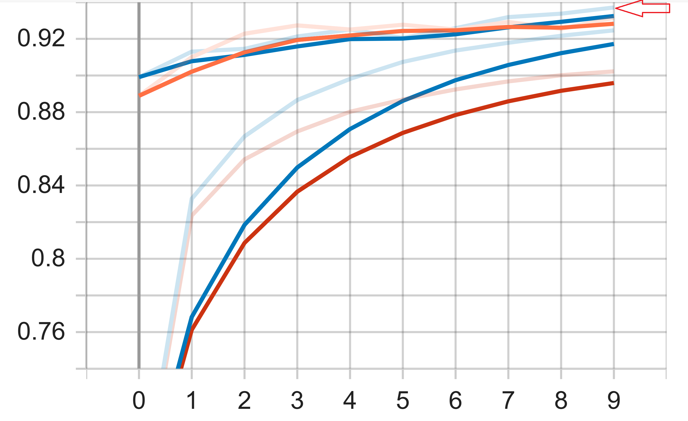
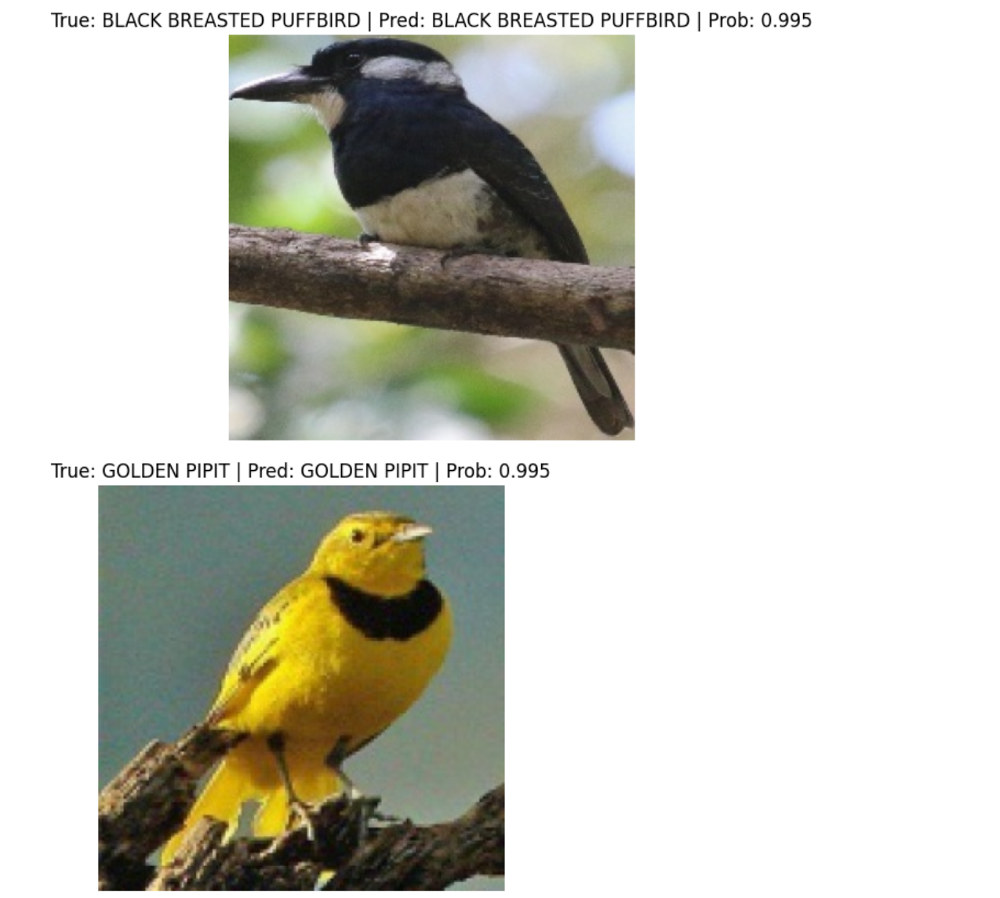
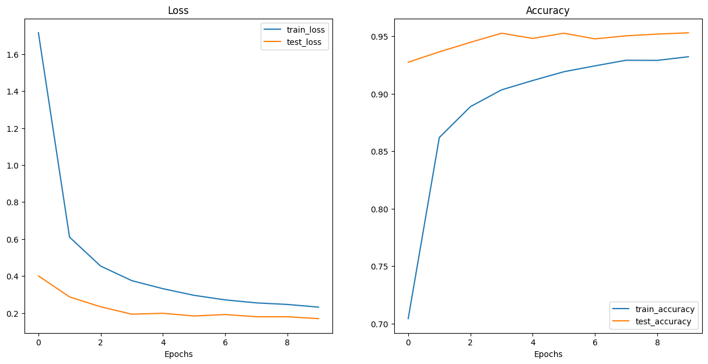
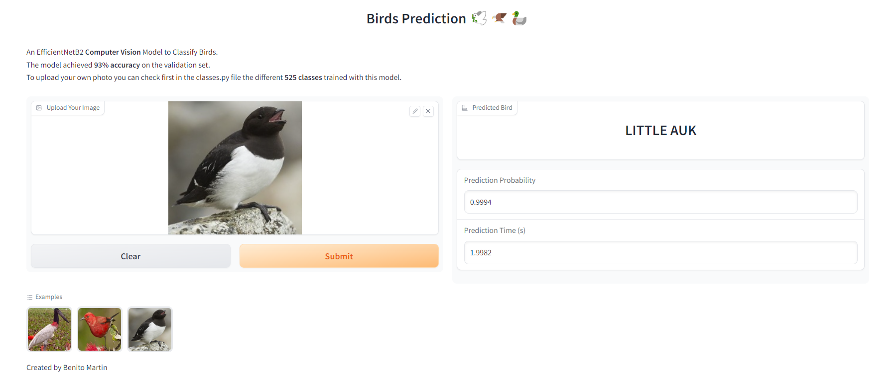

# BIRDS CLASSIFICATION 🦅

    

This repository hosts a notebook featuring an in-depth analysis of 2 **Pytorch EfficientNet** models, along with an app deployment using Gradio. The following models were meticulously evaluated:

- EffNetB0
- EffNetB2

The dataset used has been downloaded from [Kaggle](https://www.kaggle.com/datasets/gpiosenka/100-bird-species) and contains a set of 525 bird species. 84635 training images, 2625 test images(5 images per species) and 2625 validation images(5 images per species).

The app can be tested in **Hugging Face** (.py files hosted there) following this [link](https://huggingface.co/spaces/bmartinc80/birds_pytorch). Feel free to ⭐ and clone this repo 😉

## 👨‍💻 **Tech Stack**

## 🪶 Set Up

In the first stage, a set of helper functions was created in order to easily perform the modeling and prediction

- **Set seed**: Set random seeds for PyTorch operations, both on the CPU and the GPU
- **DataLoaders**: Create data loaders for training and testing datasets using PyTorch's DataLoader class
- **Writer**: SummaryWriter object for logging experiments and metrics in TensorBoard
- **Training and Testing**: Several functions for training and testing a PyTorch model 
- **Plots**: Several plots including loss curve, predictions, and images

## 📳 Modelling

The first approach was to train 2 Pytorch EfficientNet models (EffNetB0, EffNetB2) with **5 and 10 epochs** using the pre-trained model weights of EffNetB0 for the DataLoaders in order to establish a baseline. The **EffNetB2 with 10 epochs** showed the best performance above **93%** on the test set.

    

    

## ↗️ Model Improvement

Then the EffNetB2 with 10 epochs was trained again but this time using the pretrained model weights of EffNetB2 for the DataLoaders. This time an accuracy above **95%** on the **test set** and above **93%** on the **validation set** was achieved.

    

## 👏 App Deployment

The last step was to deploy an app hosted in Hugging Face using Gradio. This app can be tested with available sample images or with your own ones.

    

